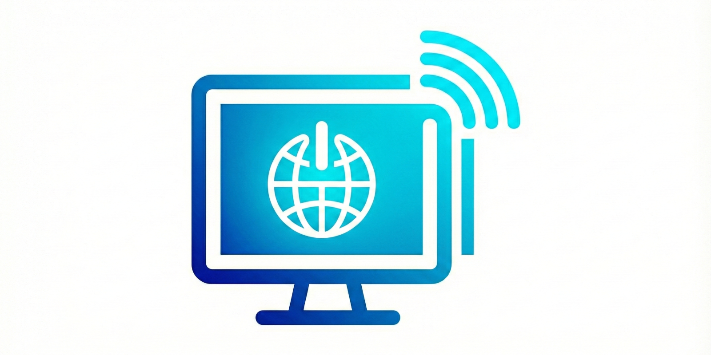

<p align="center">
  
</p>

<h1 align="center"><a href="https://github.com/qtremors/pc-rc">PC Remote Control</a></h1>

<p align="center">
  Turn your smartphone into a powerful universal remote for your PC. Control media playback, manage system power, and view your screen remotely—all from a simple, elegant web interface.
</p>

<p align="center">
  
  
  
</p>

> [!NOTE]
> **Personal Project** 🎯 I built this to easily control my media and system power from across the room without needing to install any third-party apps on my phone.

---

## ✨ Features

| Feature | Description |
|---------|-------------|
| 🎵 **Media Control** | Play/Pause, Volume Up/Down/Mute, and Track Navigation for any active media player. |
| ⚡ **System Power** | Remotely Lock, Sleep, Reboot, or Shutdown your workstation. |
| 📸 **Remote Screenshot** | Capture your PC screen in real-time and view it instantly on your mobile device. |
| 🌐 **Browser Launcher** | Launch your default web browser on the PC remotely. |
| 🔌 **Cross-Platform** | Optimized for Windows, with support for macOS and Linux. |

---

## 🚀 Quick Start

```bash
# Clone and navigate
git clone https://github.com/qtremors/pc-rc.git
cd pc-rc

# Install dependencies using uv
uv sync

# Run the project
uv run main.py
```

Visit the URL displayed in your terminal (usually `http://192.168.1.X:8000`) on your phone. Ensure both devices are on the same Wi-Fi network.

---

## 🛠️ Tech Stack

| Layer | Technology |
|-------|------------|
| **Backend** | Python, FastAPI, Uvicorn |
| **Automation** | PyAutoGUI, MSS |
| **Frontend** | HTML5, CSS3, Vanilla JavaScript |
| **Tools** | uv, python-dotenv |

---

## 📁 Project Structure

```
pc-rc/
├── assets/               # Project images and logo
├── screenshots/          # Saved remote screenshots
├── main.py               # Backend API and server logic
├── index.html            # Frontend remote interface
├── pyproject.toml        # Dependencies and build config
├── DEVELOPMENT.md        # Developer documentation
├── CHANGELOG.md          # Version history
├── LICENSE.md            # License terms
└── README.md
```

---

## 📊 System Resource usage and impact

cpu: Very Low (< 1% idle, spikes briefly during screenshot capture)
ram: ~40-60 MB (Python environment + FastAPI)
disk: < 10 MB (Application code, plus any saved screenshots)

---

## 🧪 Testing

```bash
# Manual testing is recommended for UI and hardware controls
uv run main.py
```

---

## 📚 Documentation

| Document | Description |
|----------|-------------|
| [DEVELOPMENT.md](DEVELOPMENT.md) | Architecture, setup, and API reference |
| [CHANGELOG.md](CHANGELOG.md) | Version history and release notes |
| [LICENSE.md](LICENSE.md) | License terms and attribution |
| [TASKS.md](TASKS.md) | Project roadmap and tasks |

---

## 📄 License

**Tremors Source License (TSL)** - Source-available license allowing viewing, forking, and derivative works with **mandatory attribution**. Commercial use requires written permission.

See [LICENSE.md](LICENSE.md) for full terms.

---

<p align="center">
  Made with ❤️ by <a href="https://github.com/qtremors">Tremors</a>
</p>
